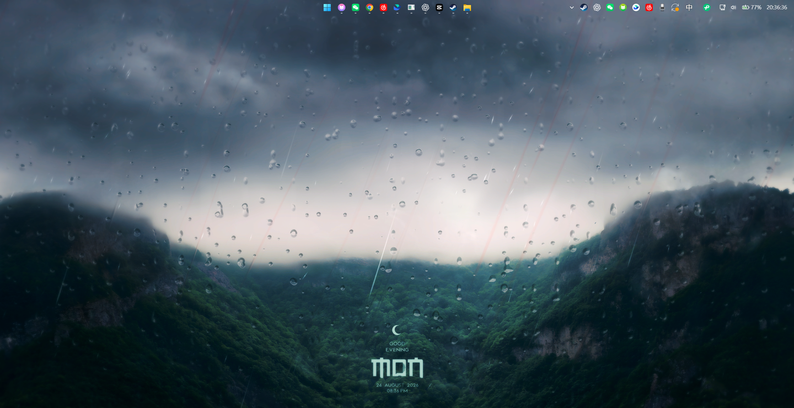
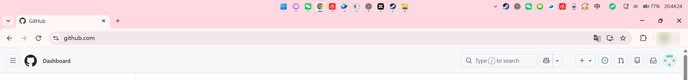
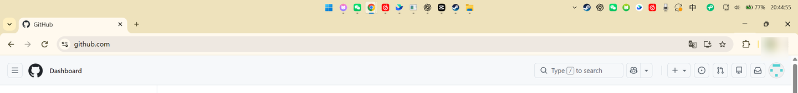
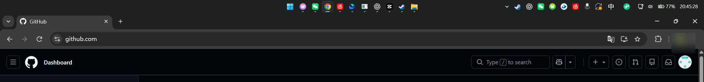

# ImmersiveTopTaskbar

让 Windows 11 的顶部任务栏真正融进当前窗口。

ImmersiveTopTaskbar 是一个面向 Windows 11 顶部任务栏的轻量沉浸工具。它会观察当前桌面窗口状态，在有窗口最大化时，把真实系统任务栏调整成更贴近窗口背景的视觉效果，让顶部任务栏不再像一条突兀的分割线。

## 案例

## 核心功能

- **最大化窗口沉浸**

  当前窗口最大化时，顶部任务栏会跟随窗口背景自动调整颜色和透明效果。

- **浅色窗口可读性优化**

  面对白色或浅色窗口时，会兼顾系统托盘图标、时间、电量等区域的可见性。

- **前景小窗口保护**

  当最大化窗口仍在后台、前面打开小窗口时，任务栏会继续保持后台最大化窗口的沉浸状态。

- **拖动状态处理**

  拖动最大化窗口本身时会切回透明状态，减少窗口移动过程中的任务栏闪烁和抢色感。

- **桌面状态恢复**

  回到桌面或退出程序时，会尽量恢复由系统和 TranslucentTB 管理的原始任务栏外观。

- **托盘常驻控制**

  程序以系统托盘形式运行，尽量少打扰，只在需要时提供控制入口。

## 浅色窗口说明

浅色最大化窗口是这个效果里最挑剔的场景。因为 Windows 的任务栏图标、托盘图标、时间、电量等元素有一部分由系统或第三方程序自己绘制，并不总是跟随任务栏背景实时切换颜色；当任务栏沉浸到接近白色的窗口背景里时，部分白色图标就可能出现对比度不足、边缘发虚或短暂不可读。

ImmersiveTopTaskbar 会尽量通过主题状态和任务栏颜色处理来改善可见性，但它不能完全接管所有系统托盘图标的绘制方式。

更推荐的使用方式：

- 优先使用 Windows 全局深色模式，深色窗口下任务栏图标对比更稳定。
- 浅色模式可以使用，但白色窗口最大化时，时间、电量或部分托盘图标可能会更容易变淡。
- 如果经常使用大面积白色应用，可以选择稍带颜色的窗口主题，沉浸效果会比纯白背景更自然。

## 适合谁

- 把 Windows 11 任务栏放在屏幕顶部的用户。
- 喜欢更干净、更沉浸桌面视觉的人。
- 经常在浅色和深色窗口之间切换，希望任务栏状态更自然的人。

## 工作方式

ImmersiveTopTaskbar 通过 Win32 桌面窗口状态检测、窗口颜色采样和 TranslucentTB ExplorerTAP 集成，直接调整真实 Windows 任务栏外观。它不是覆盖在屏幕上的假任务栏，也不是额外绘制一条遮罩。

## 目标

这个项目想解决一个很小但很烦的问题：当任务栏放到顶部时，它应该像窗口的一部分，而不是总在屏幕上割裂出一条不合群的边。
