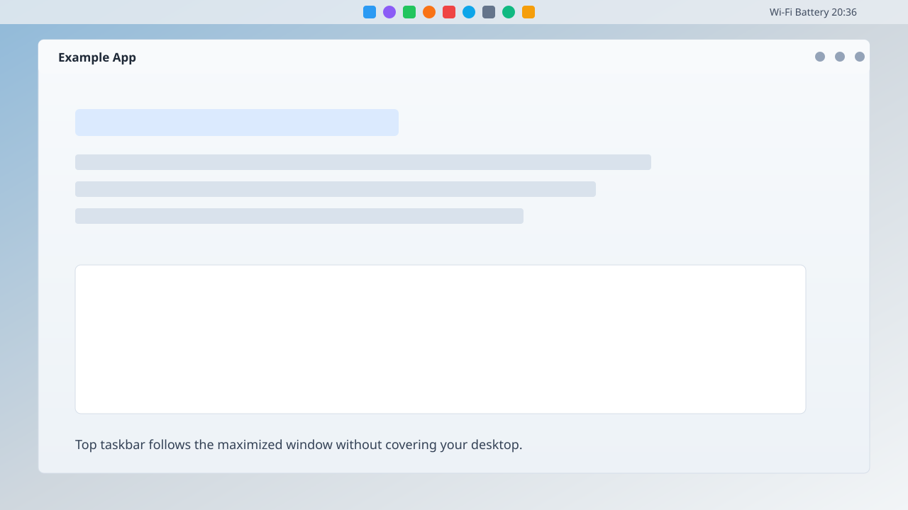
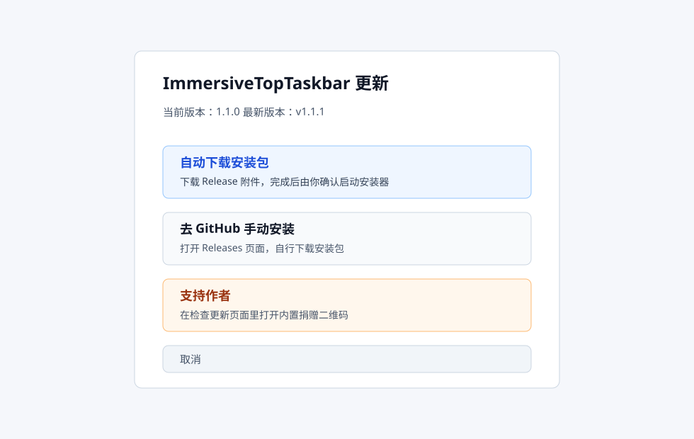

# ImmersiveTopTaskbar

让 Windows 11 的顶部任务栏真正融进当前最大化窗口里。



ImmersiveTopTaskbar 是一个轻量托盘工具。它适合把任务栏放在屏幕顶部、又喜欢干净沉浸视觉的人：窗口最大化时，任务栏会跟随窗口颜色；回到桌面、拖动窗口或切换应用时，任务栏会尽量自然地恢复或保持当前状态。

## 它能做什么

- 顶部任务栏随最大化窗口自动沉浸着色。
- 浅色窗口下自动照顾系统托盘图标可见性。
- 前景小窗口覆盖在最大化窗口上时，仍保持后台最大化窗口的沉浸感。
- 拖动最大化窗口本身时切回透明，避免窗口移动时任务栏抢色闪烁。
- 提供托盘菜单、启动环境检测、退出恢复和 GitHub Releases 更新检查。

## 更新方式

托盘菜单点击“检查更新”后，会出现一个选择页：



- **自动下载安装包**：从 GitHub Release 下载安装包，下载完成后再由你确认是否启动安装器。
- **去 GitHub 手动安装**：打开 Releases 页面，自己下载。
- **支持作者**：打开程序内置的捐赠二维码窗口。

程序不会静默安装更新，也不会自动执行远程代码。

## 安装须知

- 默认安装到 `D:\ImmersiveTopTaskbar`。
- 安装器默认勾选“开机自动启动”。
- 不需要管理员权限。
- 依赖 Microsoft Store 版 TranslucentTB，并通过 ExplorerTAP 应用任务栏外观。

第一次运行会显示使用须知和环境检测。检测通过后，后续启动会静默检测；只有缺少必要环境时才会弹窗提示。

## 隐私和安全

这个工具是本地程序。它不会上传你的窗口标题、截图或个人文件。

需要提前知道的行为：

- 会读取前台窗口、任务栏和显示器状态。
- 会临时调整当前用户的 Windows 壳层主题值，用来改善浅色任务栏下的托盘图标可见性。
- 会临时同步 TranslucentTB 的最大化窗口外观，并在退出时恢复。
- 会写本地诊断日志到 `%LOCALAPPDATA%\ImmersiveTopTaskbar\log.txt`。
- 只有检查更新和自动下载安装包时会访问 GitHub。

公开反馈问题时，请先检查日志内容，避免把窗口标题或本地路径发到 issue 里。

## 构建

需要 Windows 11 x64、MSVC Build Tools 或 Visual Studio C++ 桌面开发组件。

```bat
build.cmd
```

运行：

```bat
build\ImmersiveTopTaskbar.exe
```

退出正在运行的实例：

```bat
build\ImmersiveTopTaskbar.exe --quit
```

异常退出后恢复 TranslucentTB 外观：

```bat
build\ImmersiveTopTaskbar.exe --restore-ttb
```

异常退出后恢复 Windows 壳层主题：

```bat
build\ImmersiveTopTaskbar.exe --restore-shell-theme
```

## 支持作者

如果这个小工具确实改善了你的桌面体验，可以在托盘菜单点击“检查更新”，然后选择“支持作者”。

捐赠二维码嵌入在程序资源里，不会作为普通图片文件安装到用户目录。

## License

MIT
